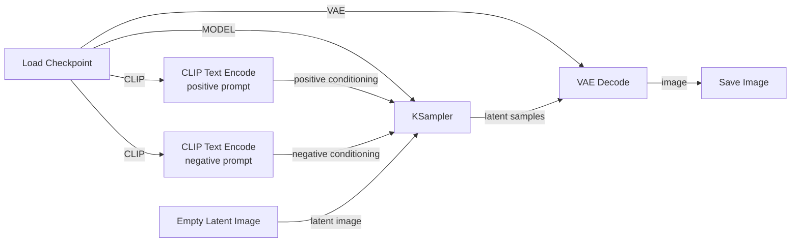

# 01 — Diffusion Microscope

## Objective

Build a minimal SDXL text-to-image workflow manually and understand what every node, socket, and connection represents.

Do this once in **ComfyUI Cloud**, then rebuild it locally.

Do **not** import a prebuilt workflow for the first pass.

## Learning outcomes

By the end of this project, you should be able to do all of the following without copying a prebuilt workflow.

### Build and navigate

- Build the seven-node text-to-image graph from memory.
- Explain what each wire carries: `MODEL`, `CLIP`, `VAE`, `CONDITIONING`, `LATENT`, and `IMAGE`.
- Recreate the workflow in both ComfyUI Cloud and local ComfyUI.
- Export and reload a workflow JSON.

### Explain the model pipeline

- Distinguish **checkpoint**, **weights**, **model architecture**, and **model component**.
- Explain why a checkpoint can expose a diffusion model, CLIP text encoder, and VAE.
- Explain how text becomes conditioning through CLIP.
- Explain the difference between latent space and pixel space.
- Explain the role of the VAE in converting between latent representations and visible images.
- Describe diffusion inference as an iterative denoising process rather than "the model drawing pixels directly."

### Reason about sampling

- Explain what `seed`, `steps`, `CFG`, `sampler`, `scheduler`, and `denoise` control.
- Predict the likely effect of changing one of those values while holding the others fixed.
- Explain why more steps do not automatically mean a better image.
- Explain the difference between the **sampler** and the **scheduler** at a high level.
- Explain why `denoise = 1.0` makes sense for a basic text-to-image workflow.

### Run controlled experiments

- Change one variable at a time and record observations.
- Hold a seed fixed to isolate changes from CFG, steps, prompts, samplers, or schedulers.
- Compare multiple outputs and form a hypothesis about what changed.
- Separate "prompt adherence" from "image quality."

### Prepare for the next project

You are ready for img2img when you understand this missing half of the pipeline:

```text
pixels → VAE Encode → latent
```

Project 2 will then combine encoding and decoding:

```text
image
  ↓
VAE Encode
  ↓
latent
  ↓
sampling / denoising
  ↓
VAE Decode
  ↓
image
```

## The seven nodes

Double-click an empty part of the ComfyUI canvas and add:

1. `Load Checkpoint`
2. `CLIP Text Encode` — positive prompt
3. `CLIP Text Encode` — negative prompt
4. `Empty Latent Image`
5. `KSampler`
6. `VAE Decode`
7. `Save Image`

You will manually connect them.

## Target graph



### Read the graph left → right

```text
                         ┌─→ positive prompt → CLIP encode ─┐
Load Checkpoint ── CLIP ┤                                 │
                         └─→ negative prompt → CLIP encode ─┤
                                                           ▼
Load Checkpoint ── MODEL ───────────────────────────────→ KSampler
Empty Latent Image ─────────────────────────────────────→ KSampler
                                                           │
                                                           ▼
                                                     latent samples
                                                           │
Load Checkpoint ── VAE ────────────────────────────────────┤
                                                           ▼
                                                       VAE Decode
                                                           │
                                                           ▼
                                                         image
                                                           │
                                                           ▼
                                                       Save Image
```

The important idea is that **`Load Checkpoint` fans out into three different components**:

- `MODEL` goes to `KSampler`
- `CLIP` goes to both text encoders
- `VAE` goes to `VAE Decode`

The two text encoders each output conditioning, while `Empty Latent Image` provides the latent canvas that the sampler will denoise.

## What to notice while connecting nodes

### Load Checkpoint

Pay attention to its three outputs:

- `MODEL`
- `CLIP`
- `VAE`

The checkpoint is not "the whole app." ComfyUI exposes components separately so they can participate in different stages of inference.

### CLIP Text Encode

Input:
- text
- CLIP model

Output:
- `CONDITIONING`

The text encoder does not draw pixels. It converts language into a representation the diffusion model can use as guidance.

### Empty Latent Image

This establishes the latent tensor dimensions used for generation.

The expensive generative process happens in latent space rather than directly in RGB pixel space.

### KSampler

Inputs include:
- model
- positive conditioning
- negative conditioning
- latent input

Important controls:
- seed
- steps
- CFG
- sampler
- scheduler
- denoise

This is the main experimental instrument for Project 1.

### VAE Decode

Converts the generated latent representation back into pixels.

```text
latent → VAE decoder → RGB image
```

### Save Image

Materializes the output so you can compare controlled experiments.

---

## First successful generation

Use one prompt for the entire first round of experiments:

> editorial photograph of a lone astronaut sitting in a diner at night, cinematic lighting

Keep the negative prompt simple at first.

Recommended rule:

> Do not optimize for the prettiest image. Optimize for understanding cause and effect.

Once you successfully generate an image, export the workflow JSON and place it in:

```text
01-diffusion-microscope/workflows/
```

Suggested filename:

```text
sdxl-basic-text-to-image.json
```

## Experiments

Change **exactly one variable at a time**.

### Experiment A — Seeds

Hold everything constant and change only the seed.

Questions:
- What remains consistent?
- What changes dramatically?
- Is composition stable?
- Is style stable?
- What does this suggest the seed controls?

### Experiment B — Steps

Try:

```text
5
10
20
30
40
```

Questions:
- At what point does additional denoising stop helping?
- What details emerge early?
- What details emerge late?

### Experiment C — CFG

Try:

```text
1
3
5
7
10
15
```

Questions:
- When does the prompt seem weak?
- When does the image become over-constrained or degraded?
- How is "prompt adherence" different from image quality?

### Experiment D — Samplers

Keep the same seed, prompt, steps, CFG, model, dimensions, and scheduler.

Compare several available samplers.

Questions:
- How much does composition move?
- How much does texture change?
- Which differences come from the model vs the numerical sampling procedure?

### Experiment E — Scheduler

Keep everything else constant and change only the scheduler.

Think about the scheduler as controlling how denoising/noise levels are distributed across the inference trajectory.

### Experiment F — Prompt language

Keep the seed fixed and make small semantic edits.

Example progression:

```text
a diner
a diner at night
a 1970s diner at night
a lonely 1970s diner at night
a lonely 1970s diner at night, cinematic photography
```

Observe what changes and what remains anchored by the seed/model.

## Knowledge checks

Do these **without looking at the workflow first**. Write your answers down before checking ComfyUI.

### Quiz 1 — Rebuild the graph

From a blank canvas, add and connect the seven nodes.

You pass if you can correctly connect:

- `MODEL`
- `CLIP`
- `VAE`
- positive conditioning
- negative conditioning
- latent input
- latent output
- final image

**Challenge:** draw the entire graph on paper before opening ComfyUI.

---

### Quiz 2 — Name the data on the wire

For each connection, answer what kind of information is flowing through it.

1. `Load Checkpoint → KSampler`
2. `Load Checkpoint → CLIP Text Encode`
3. `CLIP Text Encode → KSampler`
4. `Empty Latent Image → KSampler`
5. `KSampler → VAE Decode`
6. `Load Checkpoint → VAE Decode`
7. `VAE Decode → Save Image`

You pass if you can explain each one in plain English, not just repeat the socket name.

---

### Quiz 3 — Checkpoint vs weights

Explain the difference between:

- weights
- checkpoint
- model architecture

A strong answer should capture:

> weights are learned numerical parameters; a checkpoint is a saved artifact containing trained parameters (and sometimes additional model components/metadata); architecture describes the network structure those parameters belong to.

---

### Quiz 4 — What does CLIP do?

Answer these:

1. Does CLIP generate the final image?
2. What goes into `CLIP Text Encode`?
3. What comes out?
4. Why does the KSampler need that output?
5. Why can both positive and negative prompts use the same CLIP model?

---

### Quiz 5 — What does the VAE do?

Explain these two directions:

```text
pixels → ? → latent
latent → ? → pixels
```

Then answer:

- Which direction are we using in Project 1?
- Why does the KSampler output a latent instead of a normal PNG/JPEG image?
- What would happen conceptually if you skipped VAE Decode?

---

### Quiz 6 — Predict the KSampler

Without generating anything, predict what will happen.

#### A

```text
seed: 100 → 101
everything else fixed
```

What should change, and why?

#### B

```text
steps: 10 → 40
seed fixed
```

What might improve? Why might the improvement eventually plateau?

#### C

```text
CFG: 2 → 12
seed fixed
```

What tradeoff are you changing?

#### D

```text
sampler: Euler → another sampler
seed fixed
```

Why can the result change even though the model weights did not?

#### E

```text
denoise: 1.0 → 0.4
```

Why will this parameter become much more meaningful in img2img than it is in this basic txt2img setup?

---

### Quiz 7 — Sampler vs scheduler

Finish these sentences:

> The sampler decides ________.

> The scheduler decides ________.

A sufficient high-level answer:

- sampler: the numerical strategy used to move through the denoising trajectory
- scheduler: how noise levels/timesteps are distributed across that trajectory

Do not worry about the underlying differential-equation math yet.

---

### Quiz 8 — Debug the broken workflow

Imagine the graph has these mistakes:

1. `CLIP` is connected directly to the KSampler's `positive` input.
2. The KSampler's latent output is connected directly to `Save Image`.
3. The VAE is connected to `CLIP Text Encode`.
4. Positive and negative conditioning are accidentally swapped.

For each case:

- Is it a type/connection error or a semantic mistake?
- What should the connection be instead?
- What concept does the mistake reveal?

---

### Quiz 9 — Controlled experiment design

You want to learn whether CFG changes prompt adherence.

Which experiment is valid?

#### Experiment A

Change:
- seed
- CFG
- sampler
- prompt

#### Experiment B

Change:
- CFG only

Explain why one experiment produces interpretable evidence and the other does not.

---

### Quiz 10 — Teach it back

Explain the entire pipeline in under 90 seconds as if teaching a new ComfyUI user.

Your explanation should include these words naturally:

- checkpoint
- weights
- CLIP
- conditioning
- latent
- diffusion
- KSampler
- seed
- CFG
- VAE
- pixels

If you can teach the pipeline clearly without reading notes, Project 1 is doing its job.

---

## Practical exam

Start with a blank ComfyUI canvas and no reference material.

### Task

1. Build the text-to-image graph.
2. Load an SDXL checkpoint.
3. Generate one image.
4. Keep the seed fixed.
5. Generate a three-image step comparison.
6. Generate a three-image CFG comparison.
7. Explain why each set differs.
8. Export the workflow JSON.
9. Write a short experiment note describing what you learned.

### Pass criteria

You pass Project 1 when you can:

- build the graph unaided,
- explain every node and connection,
- predict the direction of common parameter changes,
- design a controlled experiment,
- and explain the whole text-to-image pipeline from prompt to pixels.

## Completion criteria

Do not consider Project 1 complete until you can explain, without looking anything up:

- What is a checkpoint?
- What does the text encoder do?
- What is conditioning?
- What is a latent?
- Why generate in latent space?
- What does the VAE decoder do?
- What does the seed control?
- What are diffusion steps?
- What is a sampler?
- What is a scheduler?
- What does CFG change?
- Why can the same model produce many different images?

You do not need the full mathematics yet. You need a correct operational mental model.

## Next

After this project, move to img2img.

That will introduce the missing direction of the VAE:

```text
image → VAE encode → latent → add noise / denoise → VAE decode → image
```
