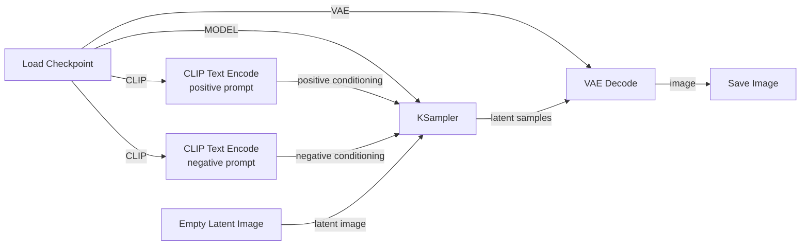

# 01 — Diffusion Microscope

## Objective

Build a minimal SDXL text-to-image workflow manually and understand what every node, socket, and connection represents.

Do this once in **ComfyUI Cloud**, then rebuild it locally.

Do **not** import a prebuilt workflow for the first pass.

## The seven nodes

Double-click an empty part of the ComfyUI canvas and add:

1. `Load Checkpoint`
2. `CLIP Text Encode` — positive prompt
3. `CLIP Text Encode` — negative prompt
4. `Empty Latent Image`
5. `KSampler`
6. `VAE Decode`
7. `Save Image`

You will manually connect them.

## Target graph



### Read the graph left → right

```text
                         ┌─→ positive prompt → CLIP encode ─┐
Load Checkpoint ── CLIP ┤                                 │
                         └─→ negative prompt → CLIP encode ─┤
                                                           ▼
Load Checkpoint ── MODEL ───────────────────────────────→ KSampler
Empty Latent Image ─────────────────────────────────────→ KSampler
                                                           │
                                                           ▼
                                                     latent samples
                                                           │
Load Checkpoint ── VAE ────────────────────────────────────┤
                                                           ▼
                                                       VAE Decode
                                                           │
                                                           ▼
                                                         image
                                                           │
                                                           ▼
                                                       Save Image
```

The important idea is that **`Load Checkpoint` fans out into three different components**:

- `MODEL` goes to `KSampler`
- `CLIP` goes to both text encoders
- `VAE` goes to `VAE Decode`

The two text encoders each output conditioning, while `Empty Latent Image` provides the latent canvas that the sampler will denoise.

## What to notice while connecting nodes

### Load Checkpoint

Pay attention to its three outputs:

- `MODEL`
- `CLIP`
- `VAE`

The checkpoint is not "the whole app." ComfyUI exposes components separately so they can participate in different stages of inference.

### CLIP Text Encode

Input:
- text
- CLIP model

Output:
- `CONDITIONING`

The text encoder does not draw pixels. It converts language into a representation the diffusion model can use as guidance.

### Empty Latent Image

This establishes the latent tensor dimensions used for generation.

The expensive generative process happens in latent space rather than directly in RGB pixel space.

### KSampler

Inputs include:
- model
- positive conditioning
- negative conditioning
- latent input

Important controls:
- seed
- steps
- CFG
- sampler
- scheduler
- denoise

This is the main experimental instrument for Project 1.

### VAE Decode

Converts the generated latent representation back into pixels.

```text
latent → VAE decoder → RGB image
```

### Save Image

Materializes the output so you can compare controlled experiments.

---

## First successful generation

Use one prompt for the entire first round of experiments:

> editorial photograph of a lone astronaut sitting in a diner at night, cinematic lighting

Keep the negative prompt simple at first.

Recommended rule:

> Do not optimize for the prettiest image. Optimize for understanding cause and effect.

Once you successfully generate an image, export the workflow JSON and place it in:

```text
01-diffusion-microscope/workflows/
```

Suggested filename:

```text
sdxl-basic-text-to-image.json
```

## Experiments

Change **exactly one variable at a time**.

### Experiment A — Seeds

Hold everything constant and change only the seed.

Questions:
- What remains consistent?
- What changes dramatically?
- Is composition stable?
- Is style stable?
- What does this suggest the seed controls?

### Experiment B — Steps

Try:

```text
5
10
20
30
40
```

Questions:
- At what point does additional denoising stop helping?
- What details emerge early?
- What details emerge late?

### Experiment C — CFG

Try:

```text
1
3
5
7
10
15
```

Questions:
- When does the prompt seem weak?
- When does the image become over-constrained or degraded?
- How is "prompt adherence" different from image quality?

### Experiment D — Samplers

Keep the same seed, prompt, steps, CFG, model, dimensions, and scheduler.

Compare several available samplers.

Questions:
- How much does composition move?
- How much does texture change?
- Which differences come from the model vs the numerical sampling procedure?

### Experiment E — Scheduler

Keep everything else constant and change only the scheduler.

Think about the scheduler as controlling how denoising/noise levels are distributed across the inference trajectory.

### Experiment F — Prompt language

Keep the seed fixed and make small semantic edits.

Example progression:

```text
a diner
a diner at night
a 1970s diner at night
a lonely 1970s diner at night
a lonely 1970s diner at night, cinematic photography
```

Observe what changes and what remains anchored by the seed/model.

## Completion criteria

Do not consider Project 1 complete until you can explain, without looking anything up:

- What is a checkpoint?
- What does the text encoder do?
- What is conditioning?
- What is a latent?
- Why generate in latent space?
- What does the VAE decoder do?
- What does the seed control?
- What are diffusion steps?
- What is a sampler?
- What is a scheduler?
- What does CFG change?
- Why can the same model produce many different images?

You do not need the full mathematics yet. You need a correct operational mental model.

## Next

After this project, move to img2img.

That will introduce the missing direction of the VAE:

```text
image → VAE encode → latent → add noise / denoise → VAE decode → image
```
