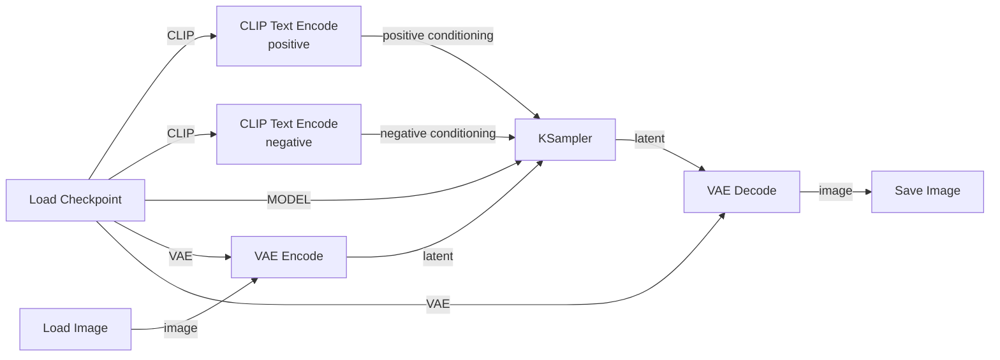

# 02 — Image-to-Image Lab

## Objective

Learn the missing half of the latent pipeline by converting a real image into latent space, modifying it through diffusion, and decoding it back into pixels.

Project 1 taught:

```text
noise
  ↓
KSampler
  ↓
latent
  ↓
VAE Decode
  ↓
image
```

Project 2 adds:

```text
image
  ↓
VAE Encode
  ↓
latent
  ↓
KSampler
  ↓
latent
  ↓
VAE Decode
  ↓
image
```

The core question for this project is:

> How much of an existing image survives when we diffuse and denoise it again?

---

## Learning outcomes

By the end of this project, you should be able to:

### Build and explain img2img

- Build an img2img workflow from a blank ComfyUI canvas.
- Explain why `VAE Encode` is required.
- Explain the difference between `VAE Encode` and `VAE Decode`.
- Explain why the KSampler works on latent representations instead of ordinary RGB pixels.
- Explain what role the source image plays in img2img.

### Understand denoise strength

- Explain what the KSampler `denoise` parameter controls.
- Predict how lower vs higher denoise values affect source-image preservation.
- Identify the point where the prompt/model begins to dominate over the source image.
- Explain why `denoise` matters much more in img2img than in basic txt2img.

### Understand latent reconstruction

- Perform an image → latent → image round trip with no diffusion.
- Observe that VAE reconstruction is lossy.
- Identify examples of details that may degrade during VAE reconstruction.

### Run controlled experiments

- Hold prompt, seed, steps, CFG, sampler, and scheduler fixed.
- Change one variable at a time.
- Compare source-image preservation against semantic transformation.
- Distinguish composition preservation from texture/style preservation.

---

## Nodes

Add:

1. `Load Checkpoint`
2. `Load Image`
3. `VAE Encode`
4. `CLIP Text Encode` — positive prompt
5. `CLIP Text Encode` — negative prompt
6. `KSampler`
7. `VAE Decode`
8. `Save Image`

---

## Target graph



Read it as:

```text
source image
    ↓
VAE Encode
    ↓
source latent
    ↓
KSampler + prompt conditioning
    ↓
modified latent
    ↓
VAE Decode
    ↓
output image
```

---

## Experiment 1 — VAE round trip

Before using the KSampler, test the VAE by itself:

```text
Load Image
   ↓
VAE Encode
   ↓
VAE Decode
   ↓
Save Image
```

Compare:

- original image
- reconstructed image

Observe:

- fine texture
- tiny text
- sharp edges
- color
- faces
- small details

### Question

Is the reconstructed image pixel-identical to the original?

If not, what does that tell you about latent compression?

---

## Experiment 2 — Denoise strength

Use one source image.

Hold all of these constant:

- source image
- prompt
- negative prompt
- seed
- steps
- CFG
- sampler
- scheduler

Change only:

```text
denoise = 0.10
denoise = 0.25
denoise = 0.50
denoise = 0.75
denoise = 1.00
```

Mental model:

```text
0.0                                      1.0
│-----------------------------------------│
preserve                               regenerate
source                                 heavily
```

Rough intuition:

```text
0.10 → tiny changes
0.25 → strong source preservation
0.50 → meaningful transformation
0.75 → major semantic/compositional drift
1.00 → source image has little control left
```

These are not hard thresholds. The experiment is to discover how your model behaves.

### Questions

- When does texture change first?
- When does object identity change?
- When does composition change?
- At what point does the prompt become more influential than the source image?

---

## Experiment 3 — Prompt vs source image

Keep:

```text
denoise = 0.35
```

Try very different prompts:

```text
photograph
oil painting
anime illustration
clay sculpture
charcoal drawing
```

Ask:

> Which parts of the source survive even when the requested style changes dramatically?

Then repeat at:

```text
denoise = 0.70
```

Compare.

---

## Experiment 4 — Semantic replacement

Use a source image with one clear subject, for example:

```text
person sitting in a chair
```

Prompt:

```text
robot sitting in a chair
```

Try:

```text
denoise 0.20
denoise 0.40
denoise 0.60
denoise 0.80
```

Observe what changes first:

- texture
- clothing
- identity
- body shape
- chair
- pose
- camera angle
- overall composition

This teaches that different kinds of information survive latent diffusion differently.

---

## Experiment 5 — Seed sensitivity in img2img

Choose one denoise value, such as:

```text
denoise = 0.50
```

Now change only the seed.

Compare:

```text
seed 100
seed 101
seed 102
```

Questions:

- Is the source image still anchoring composition?
- What changes due to seed?
- Is seed more influential at higher denoise values?

---

## Key concept: source image vs prompt

Img2img is a competition/cooperation between:

```text
SOURCE IMAGE
      ↘
       final output
      ↗
PROMPT + MODEL PRIOR
```

At lower denoise:

```text
source image >> prompt
```

At higher denoise:

```text
prompt/model prior >> source image
```

The exact balance depends on the model and all sampling settings.

---

## Knowledge checks

### Quiz 1 — Explain the VAE directions

Fill in:

```text
pixels → ______ → latent
latent → ______ → pixels
```

Then explain what each direction is used for.

---

### Quiz 2 — Why isn't img2img just pixel editing?

Explain why ComfyUI does:

```text
image → latent → diffusion → latent → image
```

instead of modifying RGB pixels directly.

---

### Quiz 3 — Predict denoise behavior

Predict the result before generating.

#### A

```text
denoise = 0.10
```

What should be preserved?

#### B

```text
denoise = 0.50
```

What kinds of features may start changing?

#### C

```text
denoise = 1.00
```

Why might the source image lose most of its influence?

---

### Quiz 4 — Controlled experiment

You want to learn the effect of denoise.

Which is valid?

#### Experiment A

Change:

- denoise
- seed
- prompt
- sampler

#### Experiment B

Change:

- denoise only

Explain why.

---

### Quiz 5 — Reconstruction loss

You run:

```text
Load Image → VAE Encode → VAE Decode
```

The output looks almost identical but tiny text and micro-detail have changed.

What does this tell you about the VAE?

---

### Quiz 6 — Source vs conditioning

If a source image clearly contains a human, but the prompt says:

```text
a marble statue
```

why might:

```text
denoise = 0.20
```

still look mostly human, while:

```text
denoise = 0.80
```

may become statue-like?

---

### Quiz 7 — Debug the graph

Find the problem in each case:

1. `Load Image` is connected directly to KSampler `latent_image`.
2. `VAE Encode` has no VAE input.
3. The KSampler output is connected directly to `Save Image`.
4. The source image is encoded with one VAE and decoded with a wildly incompatible VAE.

Explain what each error reveals about the pipeline.

---

## Practical exam

Start with a blank canvas.

1. Build the complete img2img workflow.
2. Load a source image.
3. Perform a VAE-only round trip.
4. Generate outputs at:
   - 0.20 denoise
   - 0.50 denoise
   - 0.80 denoise
5. Keep all other settings fixed.
6. Explain which properties changed at each level.
7. Export the workflow JSON.
8. Write a short experiment note.

### Pass criteria

You pass Project 2 when you can:

- build the graph unaided,
- explain both directions of the VAE,
- explain what denoise controls,
- predict low vs high denoise behavior,
- design a controlled img2img experiment,
- and explain the pipeline from source pixels to output pixels.

---

## Mental model to leave with

Project 1:

```text
text conditioning
      ↓
noise → diffusion → latent → image
```

Project 2:

```text
                     text conditioning
                            ↓
image → latent → diffusion → latent → image
```

The next project will add **spatial control** so that only selected regions are allowed to change.
